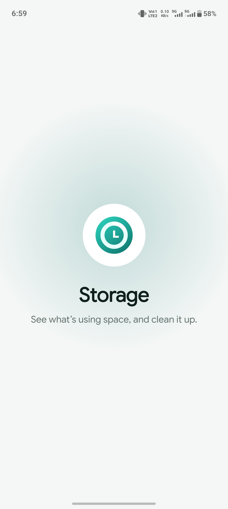
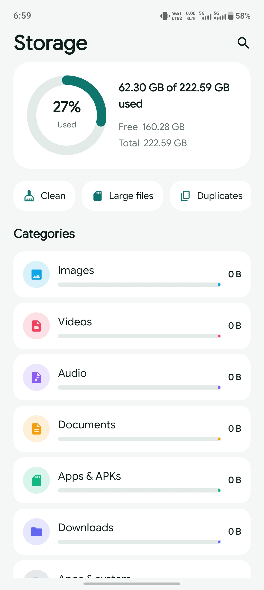

# Storage Manager 

An offline Android app for managing device storage and organizing files by category. It provides an overview of storage usage along with tools to clean up unnecessary files, find large files, and identify duplicates.

## Features

- View used, free, and total device storage
- Visual storage usage indicator
- Browse storage by categories such as Images, Videos, Audio, Documents, Apps & APKs, and Downloads
- Clean up unnecessary files
- Find large files
- Find duplicate files
- Search storage content
- Fully offline functionality
- Store application settings locally

## Screenshots

  
  

## Tech Stack

- Kotlin
- Jetpack Compose
- Material 3
- MVVM Architecture
- Room Database

## My Role

Designed and developed the entire application independently, including the UI, application logic, MVVM architecture, storage management functionality, and local settings persistence.

## Highlights

This project demonstrates practical Android development using Jetpack Compose and Material 3 with MVVM architecture. It is built as a completely offline application without API or internet dependencies, with Room used for local settings persistence and a focused interface for storage analysis and file management.